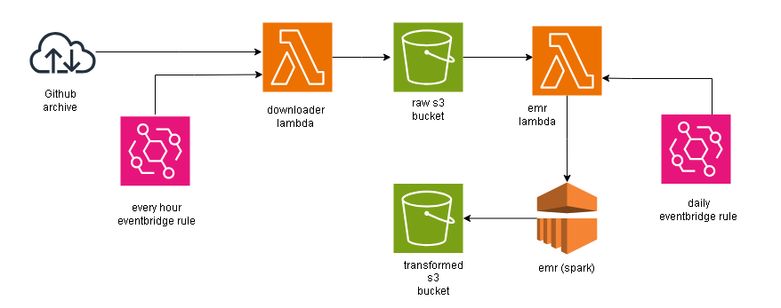

# Github User Activity Pipeline - AWS Lambda, EMR

## Overview



The user activity in github is being recorded and stored in an archive called GH Archive. The archive is being updated every hour with last 1 hour user activity data as a json file. 
 
The requirement is to capture the data every hour  in s3 and process and store it in s3 in an optimzed way.

AWS lambda is used to get the data ingest into s3. And the lambda function is being triggerd by AWS Eventbridge every hour. 

Then the raw data is data modelled in star schema and written in s3 as delta files.

The fact table is partitoned and appended each concesutive runs. 

The dimension tables updated incrementally using the merge statements in delta in each consecutive runs.

The EMR cluster is lanched by a lambda function which is triggerd by eventbridge once a day.

I have built a custom python sctipt which will take care of creating s3 buckets, iam roles, lambda functions, emr cluster and configuring event bridge rule to trigger the lambda functions.

By running that python script everything will get deployed in AWS.

## Setup
To setup this project locally, follow these steps

1. **Clone This Repositories:**
     ```bash
     git clone https://github.com/Lashmanbala/aws_lambda_emr_pipeline
     ```

2. **Configure AWS**

   Configure your aws account with your credentials in your local machine.

4. **Create .env file**

   Create .env file in the aws_resources directory, by refering the sample.env file.
   
4. **Update the script**
   
   Update the file paths and  resource names with your values in the app.py script in aws_resources directory.

   Update the BASELINE_FILE variable in the create_downloder_lambda function from when the past files should be downloaded.

5. **Run the app**
     ```bash
     cd aws_resources
     python3 app.py
     ```
