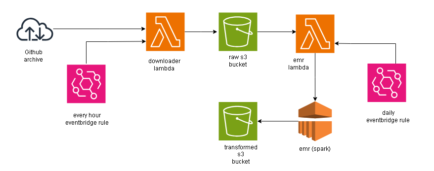

# GitHub Activity Lakehouse: AWS S3, Lambda, EMR & Delta Lake
A production-grade data platform that ingests hourly event data from GH Archive into a structured Star Schema using a serverless-to-EMR architecture.
 
 


##  Architecture Overview
*  **Source:** The user activity in github is being recorded and stored in GH Archive. The archive is being updated every hour with last 1 hour user activity data as a json file.
*   **Ingestion:** AWS Lambda + EventBridge triggers hourly JSON extraction into S3 (Bronze Layer).
*   **Processing:** Apache Spark on AWS EMR transforms raw JSON into an optimized Delta Lakehouse.
*   **Modeling:** Implemented a Star Schema (Fact/Dimension) with SCD Type 1 logic via Delta MERGE operations.
*   **Orchestration:** Time-driven execution using AWS EventBridge and Lambda-based EMR cluster provisioning.
*   **Infrastructure-as-Code:** A custom Python deployment engine utilizing `boto3` for idempotent resource creation (S3, IAM, EMR, Lambda).

##   Key Technical Features
*   **Lakehouse Consistency:** Leverages Delta Lake to provide ACID transactions and schema enforcement on S3.
*   **Operational Efficiency:** Implemented SCD Type 1 to maintain the most current state of Actors, Orgs, and Repositories while preventing record duplication.
*   **Performance Optimization:** Fact tables are partitioned by Year/Month/Day, enabling partition pruning for faster query performance.
*   **Cost Management:** Automated EMR cluster termination post-job completion to minimize cloud spend.

## Dimensional Model (Star Schema)
The pipeline converts nested JSON events into a query-optimized relational structure:
*  **Fact Table:** fact_events (Partitioned by created_at)
*  **Dimension Tables:** dim_actor, dim_repo, dim_org, dim_event_type.

## Business Insights (SQL)

* **Top 10 contributors for Pull Requests**
```bash
SELECT 
    a.login AS username,
    count(f.event_id) AS total_pr_actions,
    min(f.created_at) AS first_action_at
FROM fact_events f
JOIN dim_actor a ON f.actor_id = a.actor_id
JOIN dim_event_type e ON f.event_type = e.event_type
WHERE e.category = 'pr'
GROUP BY a.login
ORDER BY total_pr_actions DESC
LIMIT 10;
```

*  **Monthly activity trend by event category**
```bash
SELECT 
    f.year,
    f.month,
    e.category,
    count(f.event_id) AS event_count
FROM fact_events f
JOIN dim_event_type e ON f.event_type = e.event_type
GROUP BY f.year, f.month, e.category
ORDER BY f.year DESC, f.month DESC, event_count DESC;
```

*  **Repos with the most activity**
```bash
WITH RepoStats AS (
    SELECT 
        r.name AS repo_name,
        COUNT(f.event_id) AS total_interactions
    FROM fact_events f
    JOIN dim_repo r ON f.repo_id = r.repo_id
    GROUP BY r.name
)
SELECT * 
FROM RepoStats 
WHERE total_interactions > 100
ORDER BY total_interactions DESC;
```

## Setup
To setup this project locally, follow these steps

1. **Clone This Repositories:**
     ```bash
     git clone https://github.com/Lashmanbala/aws_lambda_emr_pipeline
     ```

2. **Configure AWS**

   Configure your aws account with your credentials in your local machine.

4. **Create .env file**

   Create .env file in the aws_resources directory, by refering the sample.env file.
   
4. **Update the script**
   
   Update the file paths and  resource names with your values in the app.py script in aws_resources directory.

   Update the BASELINE_FILE variable in the create_downloder_lambda function from when the past files should be downloaded.

5. **Run the app**
     ```bash
     cd aws_resources
     python3 app.py
     ```
