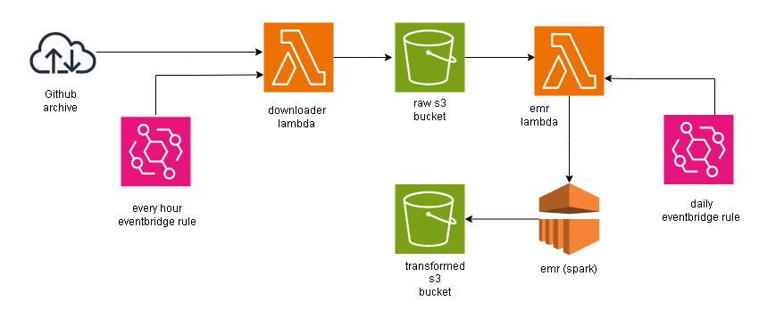

# GitHub Activity Batch Pipeline (AWS: Lambda + EMR + Delta Lake)
A serverless, batch data pipeline that ingests [GH Archive](https://www.gharchive.org/) — an hourly public archive of GitHub's global activities — lands it in S3, and transforms it into a partitioned Delta Lake star schema on a daily EMR job. The pipeline is designed to be idempotent, resumable, and self-alerting on failure.
 
 


##  Architecture Overview
*  **Source:** The user activity in github is being recorded and stored in GH Archive. The archive is being updated every hour with last 1 hour user activity data as a json file.
*   **Ingestion:** AWS Lambda + EventBridge triggers hourly JSON extraction into S3.
*   **Processing:** Apache Spark on AWS EMR transforms raw JSON into an optimized Delta Lakehouse.
*   **Modeling:** Implemented a Star Schema (Fact/Dimension) with SCD Type 1 logic via Delta MERGE operations.
*   **Orchestration:** Time-driven execution using AWS EventBridge and Lambda-based EMR cluster provisioning.
*   **Infrastructure-as-Code:** A custom Python deployment engine utilizing `boto3` for idempotent resource creation (S3, IAM, EMR, Lambda, SNS).

## Key Technical Features

- **Lakehouse Consistency:** Delta Lake provides ACID transactions and schema enforcement on S3.
- **Operational Efficiency:** SCD Type 1 keeps the most current state of Actors, Orgs, and Repos while preventing duplication; the fact table uses an insert-only `MERGE` keyed on `event_id` so re-running a batch never double-inserts.
- **Performance Optimization:** The fact table is partitioned by `year`/`month`/`day`, enabling partition pruning for both queries and merges.
- **Cost Management:** Automated EMR cluster termination after job completion minimizes cloud spend.
- **Resumability:** S3-based bookmarks let both ingestion and processing resume exactly where they left off after any interruption.
- **Failure Visibility:** Schema drift, download failures, and EMR step failures each raise alerts via SNS rather than failing silently.

---
## Repository Structure

```
.
├── aws_resources/          # Deploy-time infra provisioning (boto3 IaC)
│   ├── app.py                  # Orchestrates full deployment
│   ├── s3_util.py               # S3 bucket/object helpers
│   ├── lambda_util.py            # IAM role + Lambda function helpers
│   ├── emr_util.py                # EMR cluster/step + IAM role helpers
│   ├── event_bridge_util.py        # EventBridge rule/target helpers
│   ├── sns_util.py                  # SNS topic/subscription helpers
│   ├── lambda_function_for_emr.py    # Code deployed AS the EMR-launch Lambda
│   ├── install_boto3.sh               # EMR bootstrap action script
│   ├── requirements.txt                # Deploy-time Python deps
│   ├── sample.env                       # Template for local .env
│   └── lambda_for_emr.zip                # Packaged EMR-launch Lambda code
│
├── Ingestion/               # Code deployed AS the hourly download Lambda
│   ├── lambda_function.py       # Lambda entrypoint / handler
│   ├── download.py               # GH Archive HTTP download
│   ├── upload.py                  # S3 upload helper
│   ├── util.py                     # Bookmark read/write, next-file-name logic
│   └── ghactivity_downloader_for_lambda.zip  # Packaged Lambda code
│
└── Pyspark/                 # Code deployed AS the daily EMR Spark job
    ├── app.py                    # Spark job entrypoint (driver logic)
    ├── read.py                    # Landing zone reader
    ├── model.py                    # Fact/dimension transform logic
    ├── validate_schema.py           # Schema drift detection
    ├── write.py                      # Delta Lake write/merge logic
    ├── bookmark.py                    # Day-level bookmark read/write
    └── util.py                         # Spark session factory
```
## Data Flow

1. **Ingestion (hourly):**
   `EventBridge (rate: 60 min)` → `ghactivity-download-function` Lambda → reads bookmark from S3 → downloads next hour's `.json.gz` from GH Archive → uploads to `s3://<bucket>/landing/` → advances bookmark → repeats until caught up to the current hour (404 from GH Archive signals "no newer file yet").

2. **Processing (daily):**
   `EventBridge (cron: 0 0 * * ? *)` → `lambda_function_for_emr` Lambda → provisions EMR IAM roles/instance profile → launches a transient EMR cluster → submits a `spark-submit` step running `Pyspark/app.py` → cluster auto-terminates after the step completes.

3. **Transform (inside the Spark job):**
   Reads the prior day's landed files → validates schema → derives one fact table and four dimension tables → writes to Delta Lake (`s3://<bucket>/processed/`) → advances the day-level bookmark.

4. **Alerting:** The EMR step (via EventBridge step-state-change rule) and the ingestion Lambda (via direct SNS publish) each independently trigger an email alert on failure.

---  

## Dimensional Model (Star Schema)

The pipeline converts nested JSON events into a query-optimized relational structure, written as Delta Lake tables under `s3://<bucket>/processed/`:


**Fact table:** **`fact_events`** (partitioned by `year`, `month`, `day`, derived from `created_at`)

| Column | Description |
|---|---|
| `event_id` | GH Archive's `id` — natural key, unique per event |
| `event_type` | e.g. `PushEvent`, `PullRequestEvent` |
| `created_at` | Event timestamp |
| `is_public` | Whether the event is public |
| `actor_id`, `org_id`, `repo_id` | Foreign keys to dimension tables |
| `payload_action`, `ref`, `ref_type`, `push_id` | Common payload fields (null where not applicable) |
| `pr_number`, `issue_number`, `release_tag_name`, `forkee_full_name` | Event-type-specific fields (sparse/null by design) |

**Dimension tables** (SCD Type 1 — last write wins, no history retained):

- `dim_actor` (`actor_id`, `login`, `display_login`, `avatar_url`)
- `dim_repo` (`repo_id`, `name`, `url`)
- `dim_org` (`org_id`, `login`, `avatar_url`) — `org` is optional on GH Archive events, so this table only contains events that had one
- `dim_event_type` (`event_type`, `category`)

---
## Idempotency

Both re-running the same hour of ingestion and re-processing the same day of Spark transformation are safe:

- **Ingestion → S3 landing:** `put_object` to a deterministic key per hour — re-downloading overwrites the same key with the same bytes.
- **Fact table:** `write_delta_fact` does an insert-only `MERGE` keyed on `event_id` (+ partition columns for pruning) — a re-run finds all rows already matched and inserts nothing new.
- **Dimension tables:** `merge_delta_dim` does a full upsert `MERGE` keyed on the natural key — re-running just re-matches and updates in place, no duplication.

This is what makes scheduled retries and manual backfills safe to run without manual dedup cleanup.

---
## Schema Validation & Evolution

GH Archive's JSON isn't a versioned schema — GitHub adds fields/event types over time, and Spark's default per-batch schema inference means the inferred shape can drift batch to batch.

`validate_schema_columns` checks the fields this pipeline consumes against the actual batch's schema:

- **Missing expected field** or **type mismatch** → logged as an error and raises `ValueError`, hard-failing the Spark step, since downstream `col(...)` selects would otherwise silently produce wrong or null data.
- **New, unrecognized fields** → not checked — deciding to consume a new field is a manual code change (add to `validate_schema.py` + add the corresponding `col(...)` select in `model.py`).

On failure, the job fails loudly rather than writing incomplete data — the bookmark is never advanced, so the day is automatically retried once the underlying code is fixed.

---

## Alerting

| Trigger | Mechanism | Topic |
|---|---|---|
| Ingestion Lambda: non-200/404 download response, or any unhandled exception | Direct `sns.publish()` from within `lambda_function.py` | `ghactivity-ingestion-failure-alerts` |
| EMR step fails for any reason | EventBridge rule matching `aws.emr` / `EMR Step Status Change` / `state: FAILED` | `emr-step-failure-alerts` |

All topics have an email subscription (`ALERT_EMAIL` env var) — **check your inbox and confirm the SNS subscription** after first deploy, or no alerts will actually deliver.

---

## Backfill

There is currently no built-in backfill mechanism — both the ingestion Lambda and the Spark job are driven entirely by their bookmarks, which only support "resume from here forward." Backfilling a specific historical range today requires manually invoking the Lambda / submitting an ad-hoc EMR step.

---
## Business Insights (SQL)

* **Top 10 contributors for Pull Requests**
```bash
SELECT 
    a.login AS username,
    count(f.event_id) AS total_pr_actions,
    min(f.created_at) AS first_action_at
FROM fact_events f
JOIN dim_actor a ON f.actor_id = a.actor_id
JOIN dim_event_type e ON f.event_type = e.event_type
WHERE e.category = 'pr'
GROUP BY a.login
ORDER BY total_pr_actions DESC
LIMIT 10;
```

*  **Monthly activity trend by event category**
```bash
SELECT 
    f.year,
    f.month,
    e.category,
    count(f.event_id) AS event_count
FROM fact_events f
JOIN dim_event_type e ON f.event_type = e.event_type
GROUP BY f.year, f.month, e.category
ORDER BY f.year DESC, f.month DESC, event_count DESC;
```

*  **Repos with the most activity**
```bash
WITH RepoStats AS (
    SELECT 
        r.name AS repo_name,
        COUNT(f.event_id) AS total_interactions
    FROM fact_events f
    JOIN dim_repo r ON f.repo_id = r.repo_id
    GROUP BY r.name
)
SELECT * 
FROM RepoStats 
WHERE total_interactions > 100
ORDER BY total_interactions DESC;
```

## Setup & Deployment

1. **Clone this repository:**
   ```bash
   git clone https://github.com/Lashmanbala/aws_lambda_emr_pipeline
   ```

2. **Configure AWS**
   Configure your AWS account credentials locally.

3. **Package the Lambda/Spark code:**
   - Zip `Ingestion/` contents → matches `ghactivity_lambda_zipfile` path
   - Zip `aws_resources/lambda_function_for_emr.py` (+ deps) → matches `emr_lambda_zipfile` path
   - Zip `Pyspark/` contents → matches `spark_app_zipfile` path (referenced via `--py-files` in the Spark step)

4. **Create `.env` file**
   Create a `.env` file in the `aws_resources` directory, referring to `sample.env`. Include `ALERT_EMAIL` and `BASELINE_FILE`.

5. **Update the script**
   Update file paths and resource names with your values in `aws_resources/app.py`.
   
7. **Run the app**
   ```bash
   cd aws_resources
   pip install -r requirements.txt
   python3 app.py
   ```

8. **Confirm SNS subscriptions**
   Check `ALERT_EMAIL`'s inbox for two "AWS Notification - Subscription Confirmation" emails and confirm each, or alerts won't deliver.

---
